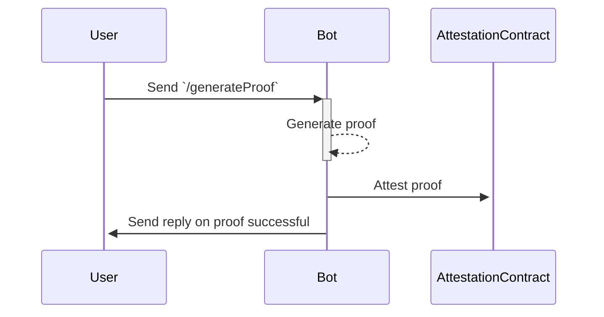

# client

Discord bot client intended to retrive user's server roles, available server roles for generating proof.

## Sequence diagram of generating proof

```mermaid
sequenceDiagram
    User->>+Bot: Send `/generateProof`
    Bot-->>-Bot: Generate proof
    Bot->>+AttestationContract: Attest proof
    Bot->>+User: Send reply on proof successful
```
